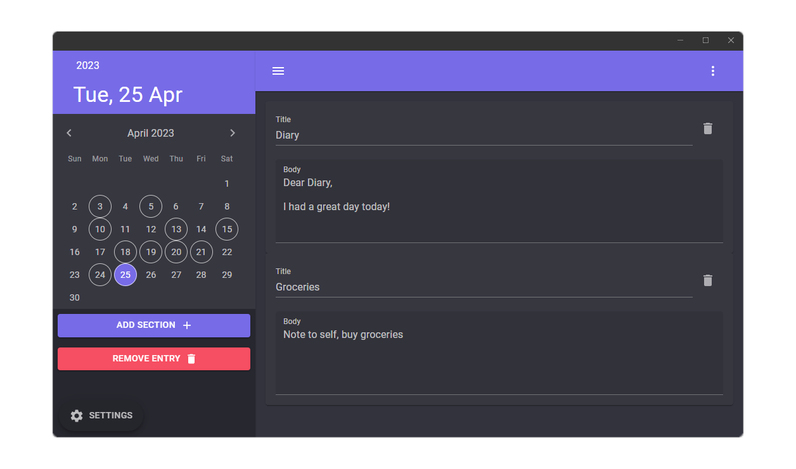

  
  <h1>Multi Diary</h1>
  
   
   
  
Multi Diary is a simple but powerful journal app for Windows that allows you to have the flexibility to create daily journals in the way that works best for you.

  

## Development
This application is built using C# and .NET's MAUI framework.

### Building/Running App
1. Clone repo: `git clone https://github.com/Owen-Krueger/MultiDiary.git`
2. Follow [Microsoft's Documentation](https://learn.microsoft.com/en-us/dotnet/maui/get-started/installation) to install/set up prerequisites on your machine.
3. Open `MultiDiary.sln` in your preferred IDE.
4. Build/Run following [Microsoft's Documentation](https://learn.microsoft.com/en-us/dotnet/maui/get-started/first-app).

## Current State
This application is not considered to be production ready yet. It's in an MVP state where it runs, but unexpected errors and data corruption should be expected. Continue to report bugs, but be warned that this application is not yet stable.

### Roadmap to 1.0
The main focus for this application to get to version 1.0 is around stability. Error handling and unit tests will be added and fleshed out to make the overall experience much more stable and reliable.

## Contributions

### Features, Bugs, Pull Requests
Pull requests, bug reporting, and suggestions are always welcome!